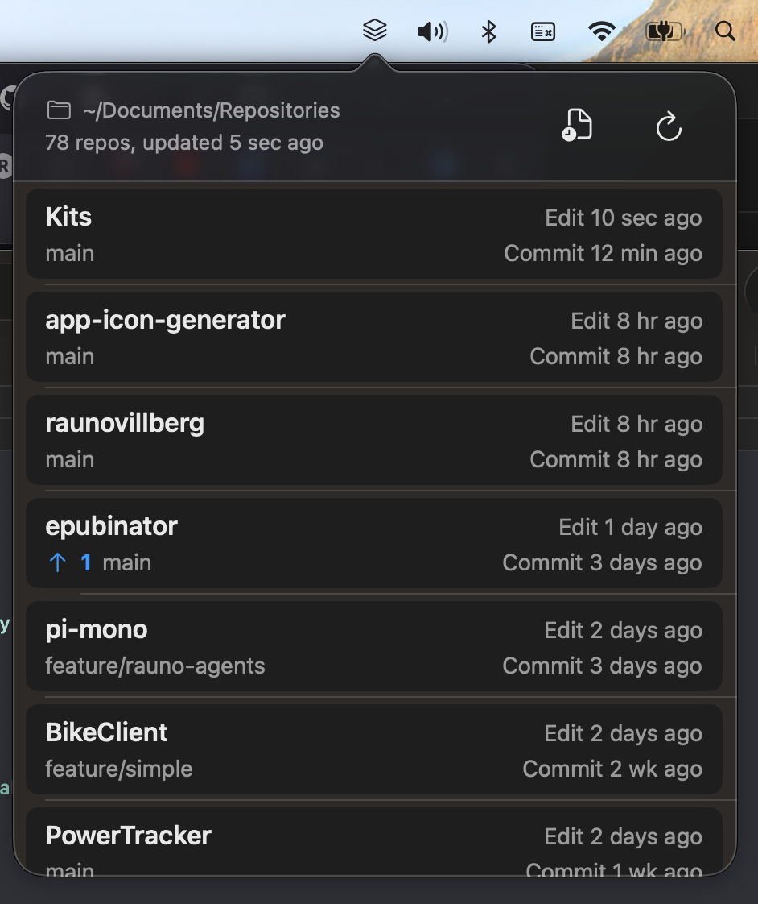
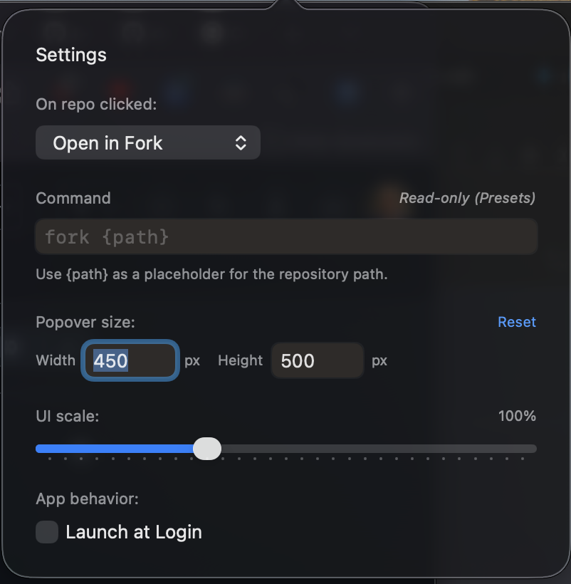

# Kits

  

**A minimalist macOS menu bar utility for monitoring local Git repositories.**

Do you have too many projects you *definitely* will *actually* finish one day? And you need to figure out which repo you actually last edited? Or commited in?

### Detailed features

- **Recursive Discovery** — Point to a root directory; Kits finds every nested repository.
- **Dynamic Sorting** — Order by current branch activity, any branch activity, file system modifications or just alphabetically.
- **Sync Tracking** — Visual indicators for ahead/behind counts relative to upstream.
- **Worktree Support** — Detects and displays linked worktrees with clear visual distinction.
- **Actionable** — Open repositories in Finder, VS Code, Fork, Tower, Terminal, iTerm2 - or define your own shell commands with `{path}` interpolation (Commands are validated for safety!)
- **Native** — Built with SwiftUI for a lightweight, modern macOS experience.
- **Slop** - Yes, it's slop. No, I haven't really looked at the code. YMMV.

### Settings

### Technical Implementation

Kits interfaces directly with `git` to maintain a low resource footprint:

- `git rev-parse` — Branch identification.
- `git status --porcelain` — Change detection.
- `git rev-list` — Remote synchronization status.
- `git for-each-ref` — Chronological activity tracking.

### Requirements

- macOS 14.0+
- Git

### Kits?
"Kits" == "deer" in Estonian. Kinda sounds like "git s(tatus)". 
And "kitse panema" == "to snitch (on somebody)", fits with Kits looking over your repositories.

Icon generated with my tool: https://raunovillberg.github.io/raunovillberg/stuff/icons.html

Feedback / issues / PR-s are welcome.

---

MIT License
